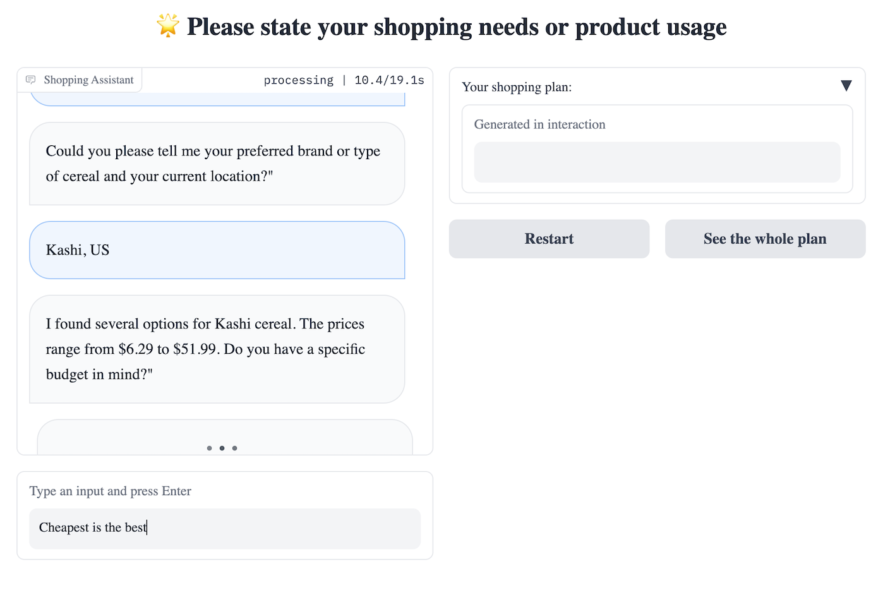

# ChatGPT-Driven Shopping Assistant

This is an application based on Langchain and powered by large language models (LLMs). It integrates state-of-the-art prompting tricks and allows LLMs to freely call external APIs, ultimately providing users with online shopping links.

## Features

- **Theory of Mind**: LLMs strive to infer users' intentions as accurately as possible, enabling the handling of ambiguous user responses.
- **Smart Retrieval of Tools**: Utilizes a FAISS-based retriever to select relevant tools based on the similarity between a user's query and the tools' descriptions.
- **ReAct Prompting**: LLMs are employed to generate both reasoning traces and task-specific actions (Thought/ Observation/ Action) in an interleaved fashion.
- **In-Context Memory**: LLMs maintain conversation history, ensuring consistency in dialogues and facilitating some mathematical operations.
- **Interactive Web Application**: Designed using the Gradio library, this feature offers users a user-friendly interface to engage with the agent.
- **Visualized Intermediate Steps**: Allows users to observe LLMs' complete reasoning process, minimizing uncertainties regarding potential hallucinations.

## Setup

1. Clone this repository to your local machine.
2. Obtain API keys for OpenAI and RapidAPI. Add these keys to a configuration file named `keys.txt` in the root directory of the project.
3. Install the required Python libraries by running `pip install -r requirements.txt` in your terminal.
4. Execute `python app.py` to launch the web application.

## References

S. Yao, J. Zhao, D. Yu, N. Du, I. Shafran, K. Narasimhan, and Y. Cao, "ReAct: Synergizing Reasoning and Acting in Language Models,"
